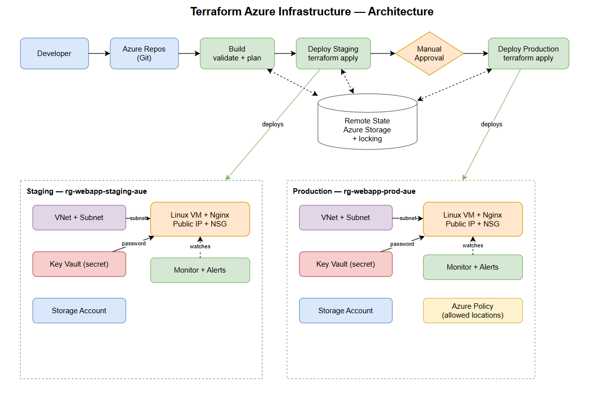

# Azure Infrastructure as Code — Terraform & Azure DevOps CI/CD


Infrastructure as Code (IaC) for provisioning and governing Azure environments using **Terraform** and **Azure DevOps CI/CD pipelines**.

A complete, multi-environment Azure platform — networking, compute, storage, secrets management, monitoring, and policy governance — provisioned and deployed automatically through a build-and-release pipeline with a manual approval gate before production.

### Skills demonstrated

Infrastructure as Code (Terraform modules, variables, outputs, remote state) · Multi-environment design (staging / production isolation) · CI/CD automation with Azure DevOps · Manual approval gates · Secrets management with Azure Key Vault · Governance with Azure Policy · Observability with Azure Monitor · Secure pipeline authentication (workload identity federation)

---

## Overview

The platform is built entirely from reusable Terraform modules and deployed to two isolated environments (**staging** and **production**). Terraform state is stored remotely in Azure Storage with state locking, and all changes flow through an Azure DevOps pipeline that validates, plans, and applies infrastructure changes safely.

---

## Architecture



> The diagram above shows the full CI/CD flow (Developer → Azure Repos → Build → Staging → Approval → Production), the central remote state, and the resources deployed in each environment.

---

## Features

- **Reusable Terraform modules** — network, compute, storage, key vault, monitoring, and policy
- **Multi-environment design** — isolated staging and production, each with its own state file
- **Remote state with locking** — Terraform state stored in Azure Storage (separate, unmanaged resource group)
- **CI/CD with Azure DevOps** — automated build (validate + plan) and release (apply) pipelines
- **Manual approval gate** — production deployments pause for human approval
- **Secrets management** — credentials generated and stored in Azure Key Vault, consumed by the VM
- **Compliance governance** — Azure Policy restricting resource locations
- **Observability** — Azure Monitor metric alerts with email notifications
- **Secure authentication** — pipeline authenticates via a service principal (workload identity federation), no stored secrets
- **Consistent tagging** — centralized tags applied across all resources

---

## Tech Stack

| Layer | Technology |
|-------|------------|
| IaC | Terraform (azurerm provider) |
| Cloud | Microsoft Azure |
| CI/CD | Azure DevOps Pipelines |
| Source Control | Git |
| Compute | Azure Linux VM (Ubuntu) + Nginx |
| Secrets | Azure Key Vault |
| Governance | Azure Policy |
| Monitoring | Azure Monitor |

---

## Repository Structure

```
terraform-azure-infrastructure/
├── azure-pipelines.yml          # CI/CD pipeline (build + release stages)
├── modules/                     # Reusable building blocks
│   ├── network/                 # VNet + subnet
│   ├── compute/                 # VM, NIC, NSG, public IP
│   ├── storage/                 # Storage account
│   ├── keyvault/                # Key Vault + secret
│   ├── monitoring/              # Action group + metric alert
│   └── policy/                  # Azure Policy assignment
└── environments/
    ├── staging/                 # Staging configuration + state
    └── production/              # Production configuration + state
```

---

## Modules

| Module | Purpose |
|--------|---------|
| `network` | Creates a virtual network and subnet |
| `compute` | Provisions a Linux VM with a public IP, network interface, and firewall (NSG); installs a web server on boot |
| `storage` | Creates a globally-unique storage account |
| `keyvault` | Creates a Key Vault, generates a strong password, and stores it as a secret |
| `monitoring` | Sets up an action group (email) and a CPU metric alert on the VM |
| `policy` | Assigns the built-in "Allowed locations" policy to enforce regional compliance |

---

## CI/CD Pipeline

The pipeline (`azure-pipelines.yml`) is a multi-stage Azure DevOps pipeline:

1. **Build** — installs Terraform, runs `terraform validate` and `terraform plan` (a safety preview; changes nothing).
2. **Deploy Staging** — runs `terraform apply` against the staging environment automatically.
3. **Deploy Production** — runs `terraform apply` against production, gated by a **manual approval** check.

Each stage authenticates to Azure using a service principal via an Azure Resource Manager service connection.

---

## Getting Started

### Prerequisites

- An Azure subscription
- An Azure DevOps organization and project
- Locally installed: Terraform, Azure CLI, Git

### Deploy locally

```bash
# Authenticate
az login

# Move into an environment
cd environments/staging

# Initialize, review, and apply
terraform init
terraform plan
terraform apply
```

### Deploy via pipeline

Push to the `main` branch — the pipeline automatically validates, plans, deploys to staging, then waits for approval before deploying to production.

---

## Governance & Security

- **Remote state** is isolated in its own resource group, never managed by the workload pipeline, so it cannot be accidentally destroyed.
- **Secrets** are never hard-coded; the VM password is generated by Terraform and stored in Key Vault.
- **Azure Policy** prevents resources from being created outside approved regions.
- **The `.gitignore`** excludes all state files and secret files from version control.

---

## Possible Future Enhancements

- Save the Terraform plan as a pipeline artifact and apply the exact reviewed plan
- Add security scanning (tfsec / Checkov) to the build stage
- Adopt the official Azure naming module for standardized naming
- Add VNet integration and a managed identity for the application

---

## Author

**Muhammad Farhan Sohail** — [LinkedIn](https://www.linkedin.com/in/muhammad-farhan-sohail-019a37220/)
